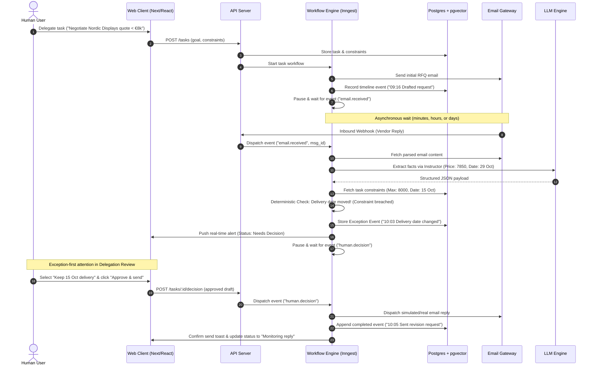

# ActAI Backend & Database Architecture Proposal

> **Status**: Ready for Review & Brainstorming  
> **Prepared by**: Lead System Architect Subagent  
> **Scope**: Backend platform architecture, durable workflow engine, database schema, email ingestion pipeline, and deterministic policy guardrails for the ActAI Platform.

---

## 1. Durable Execution & Workflow Engine

Delegated multi-step asynchronous email tasks require a state engine that can pause for days, handle webhook events, withstand server restarts without losing in-flight state, and cleanly support human-in-the-loop approvals.

### Engine Comparison

| Dimension | Inngest (Recommended) | Temporal.io | Hatchet | Custom (Postgres + BullMQ) |
| :--- | :--- | :--- | :--- | :--- |
| **Human-in-the-loop** | **Native**: `step.waitForEvent` | Native: Signals & Queries | Good: Event DAGs | Manual: Complex polling/state tracking |
| **Multi-day sleep** | **Native**: Zero idle cost | Native: Timer-backed | Good: Async workers | Cron/polling jobs |
| **Developer Velocity**| **High**: Code-as-workflows, serverless friendly | Medium: Strict determinism & SDK boilerplate | Medium: Python/TS SDKs | Low: Rebuilding state machines from scratch |
| **Operational Overhead**| **Low**: Managed cloud or single-binary dev | High: Cassandra/Postgres + multiple services | Moderate: Docker/Go backend | High: Managing queue drift, locks, idempotency |
| **Deterministic Replay**| Step-level caching & memoization | Full event history replay | Step execution tracking | Manual database logging |

### Recommendation: **Inngest** (with Temporal as Enterprise Self-Hosted Alternative)
- **Why Inngest**: Inngest's `step.waitForEvent('email.received', { timeout: '7d' })` and `step.waitForEvent('human.decision', { timeout: '30d' })` map 1:1 to the ActAI PRD. When a vendor takes 3 days to reply, the function is paused with 0 CPU cost. When the webhook fires, the workflow resumes at the exact step with full context.
- **Enterprise Edge**: If clients require strictly air-gapped on-premise execution, Temporal serves as the secondary drop-in alternative.

---

## 2. Database Schema & Data Modeling

A production-grade PostgreSQL database with `pgvector` for unified relational integrity and semantic retrieval.

```sql
-- 1. Multi-tenant foundation
CREATE TABLE organizations (
    id UUID PRIMARY KEY DEFAULT gen_random_uuid(),
    name VARCHAR(255) NOT NULL,
    created_at TIMESTAMPTZ DEFAULT NOW()
);

CREATE TABLE users (
    id UUID PRIMARY KEY DEFAULT gen_random_uuid(),
    org_id UUID REFERENCES organizations(id) ON DELETE CASCADE,
    email VARCHAR(255) UNIQUE NOT NULL,
    full_name VARCHAR(255),
    role VARCHAR(50) DEFAULT 'member',
    created_at TIMESTAMPTZ DEFAULT NOW()
);

-- 2. Delegated Tasks & Goals
CREATE TABLE delegated_tasks (
    id UUID PRIMARY KEY DEFAULT gen_random_uuid(),
    org_id UUID REFERENCES organizations(id) ON DELETE CASCADE,
    user_id UUID REFERENCES users(id) ON DELETE SET NULL,
    title VARCHAR(255) NOT NULL,
    goal TEXT NOT NULL,
    status VARCHAR(50) DEFAULT 'in_progress', 
    -- 'in_progress' | 'awaiting_decision' | 'draft_ready' | 'monitoring' | 'paused' | 'completed'
    priority VARCHAR(20) DEFAULT 'normal',
    workflow_run_id VARCHAR(255), -- External workflow engine reference ID
    created_at TIMESTAMPTZ DEFAULT NOW(),
    updated_at TIMESTAMPTZ DEFAULT NOW()
);

-- 3. Bounded Task Constraints & Policy Limits
CREATE TABLE task_constraints (
    id UUID PRIMARY KEY DEFAULT gen_random_uuid(),
    task_id UUID REFERENCES delegated_tasks(id) ON DELETE CASCADE,
    type VARCHAR(50) NOT NULL, -- 'budget_cap' | 'delivery_deadline' | 'human_approval_required'
    parameters JSONB NOT NULL, -- e.g., {"max_amount": 8000, "currency": "EUR", "strict": true}
    created_at TIMESTAMPTZ DEFAULT NOW()
);

-- 4. Immutable Audit & Execution Record (Append-Only Event Store)
CREATE TABLE audit_events (
    id UUID PRIMARY KEY DEFAULT gen_random_uuid(),
    task_id UUID REFERENCES delegated_tasks(id) ON DELETE CASCADE,
    event_type VARCHAR(100) NOT NULL, 
    -- 'email_read' | 'constraint_found' | 'draft_prepared' | 'exception_detected' | 'human_approved' | 'email_sent'
    summary TEXT NOT NULL,
    evidence_id UUID,
    payload JSONB NOT NULL,
    created_at TIMESTAMPTZ DEFAULT NOW()
);

-- 5. Evidence & Vector Storage
CREATE EXTENSION IF NOT EXISTS vector;

CREATE TABLE evidence_sources (
    id UUID PRIMARY KEY DEFAULT gen_random_uuid(),
    task_id UUID REFERENCES delegated_tasks(id) ON DELETE CASCADE,
    type VARCHAR(50) NOT NULL, -- 'email_message' | 'project_note' | 'quote_attachment'
    title VARCHAR(255) NOT NULL,
    source_reference VARCHAR(500), -- Message-ID, Note URI, or Document path
    content TEXT NOT NULL,
    snippet TEXT,
    embedding vector(1536), -- text-embedding-3-small
    metadata JSONB,
    created_at TIMESTAMPTZ DEFAULT NOW()
);

-- 6. Decisions & Consequence Records
CREATE TABLE decisions (
    id UUID PRIMARY KEY DEFAULT gen_random_uuid(),
    task_id UUID REFERENCES delegated_tasks(id) ON DELETE CASCADE,
    trigger_event_id UUID REFERENCES audit_events(id),
    selected_option VARCHAR(100) NOT NULL,
    consequence_explanation TEXT NOT NULL,
    approved_by UUID REFERENCES users(id),
    approved_draft TEXT,
    decided_at TIMESTAMPTZ DEFAULT NOW()
);
```

### Vector Search Strategy
- **Why `pgvector` inside PostgreSQL**: Avoids dual-database synchronization overhead (Pinecone/Qdrant + Postgres).
- **Hybrid Queries**: Allows querying relevant evidence with relational filtering in a single SQL query:
  ```sql
  SELECT title, snippet, 1 - (embedding <=> $query_embedding) AS similarity
  FROM evidence_sources
  WHERE task_id = $task_id
  ORDER BY similarity DESC
  LIMIT 5;
  ```

---

## 3. Email Integration & Ingestion Pipeline

### Architecture Diagram & Flow
1. **Gmail**: Google Workspace API + Cloud Pub/Sub push subscription.
2. **Outlook**: Microsoft Graph API + Webhook Subscriptions.

```text
[ Gmail / Outlook Webhook ] 
       │ (Payload: Message ID only)
       ▼
[ Ingestion Gateway / Serverless Function ]
       │ (Validate HMAC / OAuth webhook signature)
       ▼
[ Message Fetch & Deduplication Worker ]
       │ - Fetch MIME message via API
       │ - Idempotency Key: hash(tenant_id + message_id)
       │ - Thread Reconstruction via 'In-Reply-To' & 'References' headers
       ▼
[ Dispatched to Workflow Engine ]
       │ (Triggers 'email.received' event to waiting task)
```

### Security & Privacy
- **OAuth Token Lifecycle**: Background workers continually refresh tokens before expiry.
- **KMS Envelope Encryption**: Mailbox access/refresh tokens are encrypted using AWS KMS / GCP Cloud KMS. No unencrypted mailbox credentials exist in application logs or standard database dumps.
- **Least-Privilege Scopes**: Request restricted thread-level or label-level permissions rather than full indiscriminate inbox access where supported.

---

## 4. Deterministic Guardrails & AI Agent Engine

ActAI’s fundamental promise is that **the agent never commits to changes without explicit human consent**.

### The Three-Layer Guardrail Architecture

```text
┌────────────────────────────────────────────────────────┐
│ 1. Non-Deterministic Fact Extraction (Fast / Cheap LLM) │
│    - Model: Claude 3.5 Haiku / GPT-4o-mini              │
│    - Framework: Instructor / Pydantic / BAML           │
│    - Output: Strictly typed JSON facts                 │
│      { price: 7850, delivery_date: "2026-10-29" }     │
└──────────────────────────┬─────────────────────────────┘
                           │ Typed JSON
                           ▼
┌────────────────────────────────────────────────────────┐
│ 2. Deterministic Code-Level Policy Engine (TypeScript) │
│    - Checks extracted values against task_constraints  │
│    - Example:                                          │
│      if (extracted.delivery_date > task.delivery_cap)  │
│          return { status: "VIOLATION", pause: true }   │
│    - ZERO LLM involvement in the policy verdict!       │
└──────────────────────────┬─────────────────────────────┘
                           │ Exception Detected
                           ▼
┌────────────────────────────────────────────────────────┐
│ 3. Human Review & Frontier Synthesis (Frontier LLM)    │
│    - System pauses and creates "Needs Decision" event  │
│    - User selects bounded direction: "Keep 15 Oct"     │
│    - Frontier Model (Sonnet 3.5) synthesizes draft     │
│    - Human reviews editable draft before send          │
└────────────────────────────────────────────────────────┘
```

---

## 5. End-to-End Workflow Sequence



---

## 6. Scalability & Operational Blueprint

- **API & Workers**: Stateless Node.js / Go microservices deployed on Kubernetes / ECS with autoscaling on queue depth.
- **Connection Pooling**: PgBouncer managing connection limits to Postgres.
- **Resilience**:
  - Exponential backoff and jitter on all email vendor APIs.
  - Webhook replay buffer (7-day retention in Redis/Kafka) to recover from temporary ingestion outages.
  - Idempotent event processing ensuring no duplicate emails are sent even if workers restart mid-task.
